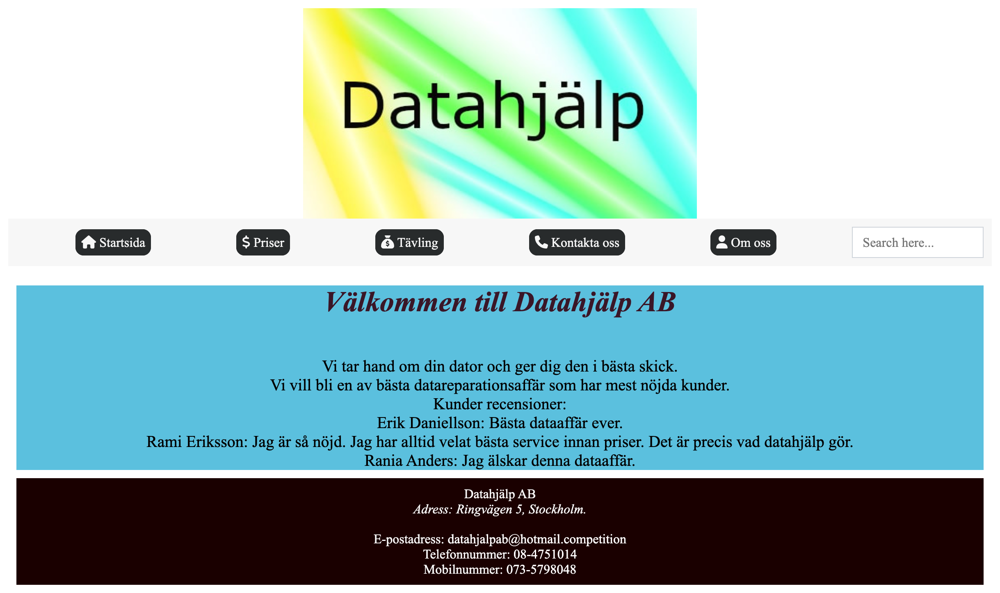

# Datahjälp

[](https://opensource.org/licenses/MIT)

Datahjälp is a company that provides computer repair services and information about pricing and contact details. The company is located at Ringvägen 5, Stockholm, Sweden. This project is the official website for Datahjälp, featuring a responsive design that works well on all devices.

## [Visit](https://fadihanna123.github.io/DatahjalpProjekt)

## 🌟 Features

- 📱 Responsive design for all devices
- 💰 Transparent pricing information
- 📞 Easy access to contact details
- 🎯 Company information and services
- 🎁 Competition participation
- 🏢 Location information

## 🚀 Quick Start

### Prerequisites

- Node.js (>=16.0.0)
- Yarn package manager

### Installation

1. Clone the repository:
```bash
git clone https://github.com/fadihanna123/DatahjalpProjekt.git
cd DatahjalpProjekt
```

2. Install dependencies:
```bash
yarn setup
```

3. Start the development server:
```bash
yarn dev
```

The website will be available at [http://localhost:3000](http://localhost:3000)

## 🛠️ Development

### Available Scripts

- `yarn setup` - Install project dependencies
- `yarn dev` - Start development server
- `yarn lint` - Run ESLint, Stylelint, and HTMLHint
- `yarn format` - Format code using Prettier
- `yarn clear` - Remove node_modules directory

### Code Quality

This project uses several tools to maintain code quality:
- ESLint for JavaScript linting
- Stylelint for CSS linting
- HTMLHint for HTML validation
- Prettier for code formatting
- Husky for git hooks

## 🤝 Contributing

Contributions are welcome! Please follow these steps:

1. Fork the repository
2. Create your feature branch (`git checkout -b feature/amazing-feature`)
3. Commit your changes (`git commit -m 'Add some amazing feature'`)
4. Push to the branch (`git push origin feature/amazing-feature`)
5. Open a Pull Request

## Screenshot


## 📝 License

This project is licensed under the MIT License - see the [LICENSE](LICENSE) file for details.
